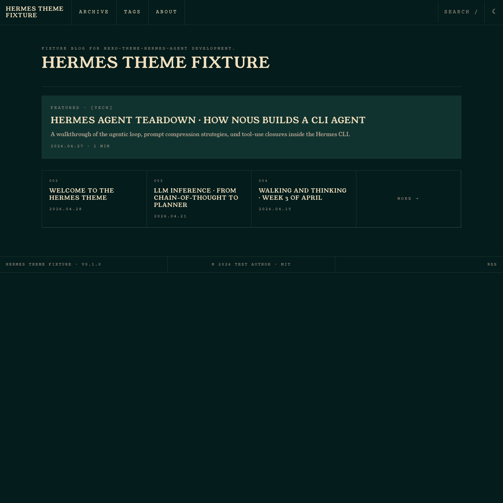
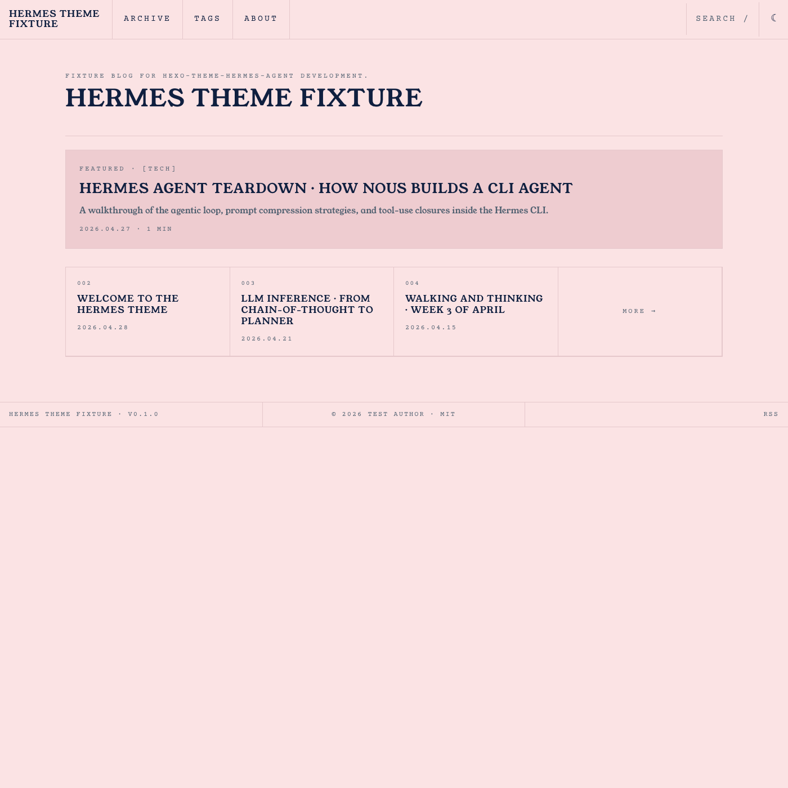

# hexo-theme-hermes-agent

A Hexo theme that brings the Nous Research Hermes Agent terminal aesthetic to static blogs.

## Screenshots




## Features

- Deep-teal / warm-cream phosphor-decay palette sampled from the Hermes reference site
- Invert-based light mode (`html.light { filter: invert(1); }`) with `.no-invert` escape for images, code, and KaTeX
- Terminal-style post meta (`$ cat posts/slug.md`), blink cursor, grid-framed panels
- Sticky TOC with scroll-based highlighting via IntersectionObserver
- `/`-triggered search modal, client-side fuzzy filter, arrow-key navigation
- Code block COPY button, Prism token overrides
- `g` chord navigation (`g h` = home, `g a` = archives, `g t` = tags), `t` toggles theme
- KaTeX opt-in via `math: true` front-matter
- English + zh-CN language packs (extendable)
- Mobile hamburger drawer, 3 responsive breakpoints (1200, 768, 480)
- OFL fonts bundled (Young Serif, Archivo, Archivo Narrow, Courier Prime)

## Install

```bash
cd your-hexo-blog
git clone https://github.com/zhiwei-Feng/hexo-theme-hermes-agent themes/hermes-agent
npm install hexo-renderer-ejs hexo-renderer-sass-next hexo-generator-search
```

Then set `theme: hermes-agent` in the site's `_config.yml`.

## Configuration

All keys belong in `themes/hermes-agent/_config.yml` (or copy them into your site-level theme config block).

```yaml
# Override the display title and tagline shown above the nav.
# Defaults to config.title / config.subtitle if left empty.
site_title: ""
tagline: ""

# Top navigation entries. Each entry needs `name` and either `path` (site-relative) or `url` (absolute).
nav:
  - { name: ARCHIVE, path: /archives/ }
  - { name: TAGS, path: /tags/ }
  - { name: ABOUT, path: /about/ }

# Light/dark strategy.
# `invert` (default): light mode is achieved via `filter: invert(1)` on `html.light`.
# `classic`: reserved for v0.2; will use a conventional light colour palette.
theme_mode: invert

# Which post appears in the homepage featured card.
# `latest`: always the most recent post.
# `front_matter`: post with `featured: true` in its front-matter, falling back to newest.
featured_post: front_matter

# Bundled font family IDs for display (headings) and mono (code) faces.
# Available IDs: young_serif, archivo, archivo_narrow, courier_prime
fonts:
  display: young_serif
  mono: courier_prime

# Visual effects; set any to false to disable.
effects:
  dither: true      # CRT noise overlay on the hero panel
  blink: true       # blinking cursor in terminal-style meta lines
  arc_border: true  # rounded-arc border on the featured card
  bevel: true       # inset bevel shadow on grid panels

# Search modal powered by hexo-generator-search.
# shortcut: key that opens the modal (default "/").
search:
  enable: true
  shortcut: "/"

# Giscus comment scaffold. Set enable: true and fill in the repo fields
# after wiring up a Giscus app on your GitHub repository.
comments:
  enable: false
  giscus:
    repo: ""        # e.g. username/repo
    repo_id: ""     # from giscus.app
    category_id: "" # from giscus.app

# KaTeX math rendering.
# When per_post is true, KaTeX only loads on posts that have `math: true` in front-matter.
katex:
  enable: true
  per_post: true

# Footer links. Set github to your username string; rss: true emits the default /atom.xml link.
social:
  github: ""
  rss: true

# Optional 8-token colour overrides. Remove the whole block to use the defaults.
palette:
  background: "#041c1b"
  surface: "#11332f"
  background_deep: "#000203"
  line: "#1a3834"
  foreground: "#f0e0c0"
  foreground_dim: "#b0a090"
  midground: "#384038"
  accent: "#fb2c36"
```

## Customizing fonts

The bundled OFL fonts cover most use cases. To swap in a commercial typeface (e.g. `Mondwest-Regular.woff2`):

1. Drop the `.woff2` file into your site's `source/fonts/` directory (Hexo copies `source/` to `public/` on build).
2. Create a custom stylesheet — for example `source/css/custom.css` — and declare the `@font-face` there. Load it after the theme by adding it to your layout or via `hexo-inject`.
3. Override the CSS custom property the theme exposes:

```scss
@font-face {
  font-family: "Mondwest";
  src: url("/fonts/Mondwest-Regular.woff2") format("woff2");
  font-weight: 400;
  font-style: normal;
}

:root {
  --font-display: "Mondwest", serif;
}
```

The theme uses `var(--font-display)` for all headings and the site title, so a single property override is sufficient.

## Front-matter supported

| Key | Type | Effect |
|-----|------|--------|
| `description` | string | Renders as the post subtitle under the title |
| `featured` | bool | Marks a post as the homepage featured card (requires `featured_post: front_matter`) |
| `math` | bool | Loads KaTeX on this post only (when `katex.per_post: true`) |
| `toc` | bool | Set to `false` to disable the TOC on a specific post |
| `layout` | string | `about` invokes the grid-cell layout where each H2 becomes a cell |

## Keyboard shortcuts

| Key | Action |
|-----|--------|
| `/` | Open search |
| `t` | Toggle light/dark |
| `g h` | Go home |
| `g a` | Go to archives |
| `g t` | Go to tags |
| `Esc` | Close modals |

## Browser support

Latest two versions of Chromium, Firefox, Safari. No IE support.

## License

MIT for the theme code (see `LICENSE`). Bundled fonts are OFL — see `theme/source/fonts/OFL.txt` for attributions.

## Credits

Visual language inspired by the [Nous Research Hermes Agent site](https://hermes-agent.nousresearch.com/). This is an unofficial fan theme. Not affiliated with or endorsed by Nous Research.
